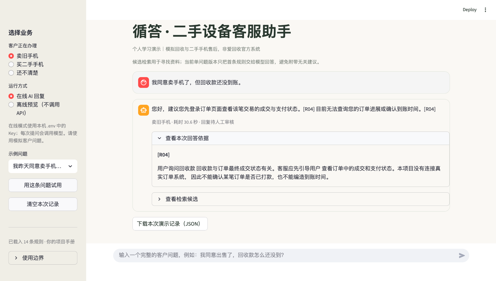

# After-Sales Support RAG Assistant

A local RAG prototype for Chinese-language, second-hand smartphone after-sales questions. It routes seller and buyer cases to a small simulated policy manual, retrieves relevant rules, and displays the evidence alongside a generated response.

**Independent learning project. All policies and example customers are fictional. This repository is not affiliated with Aihuishou, Paipai, or any phone reseller. It has no access to real orders, payments, shipping, or customer-service tickets.**

## Local demo screenshot

This screenshot was captured from a user-run online session with the simulated manual. The assistant suggests checking order status and says it cannot check a real payment time. The open R04 panel shows the rule provided as evidence. One example does not establish reliability on other questions.

## What the demo shows

- Select selling an old phone, buying a used phone, or an unclear business type. The last option asks for clarification.
- Parse 14 labeled mock manual entries (R01–R06, B01–B06, G01–G02). Retrieval uses rules from the selected business type; G01 handles ambiguous business type. G02 is currently descriptive data and is not an active retrieval filter.
- In online mode, embed the question and manual rules with a compatible embeddings API, rank candidates by cosine similarity, and apply explicit checks for certain business intents and numeric day boundaries.
- Display the three highest-ranked candidates while sending only the first rule to the Qwen answer model for a single-issue question.
- Check cited rule IDs, reject some unsupported claims of order lookup or action, and return a fixed refusal for a short list of clearly unrelated topics.
- Run a local Streamlit demo, inspect the answer evidence, and export the current session as JSON for review.

Responses marked as needing review require a person to verify their meaning. A valid citation ID only proves that the ID was available to the model; it does not prove every sentence is supported.

## Try it locally

Requires Python 3.10 or newer. The interface and mock manual are in Chinese; this README documents the implementation in English.

    python3 -m venv .venv
    source .venv/bin/activate
    python -m pip install -r requirements-demo.txt
    cp .env.example .env

Edit the local .env file to add your own DASHSCOPE_API_KEY. Check the endpoint and model names against your own provider account. Keep your key private. Then start the UI:

    python -m streamlit run app.py

The local address shown in your terminal will open the demo. Select **Offline preview** to see a manual excerpt without calling the provider; select **Online AI answer** to use embeddings and Qwen. Provider requests may incur charges.

The retrieval-only command works without installing the API SDK or setting a key:

    python3 rag_upgrade.py "卖掉旧手机后，款项怎么还没到？" --business R --mode lexical --policies data/policies.md

Available CLI business values: R = seller, B = buyer, ? = unclear. To generate an online answer, add --mode vector --answer and set your local .env key.

## How the response is produced

| Step | Implementation | Why it exists |
| --- | --- | --- |
| Business scope | Seller/buyer/unknown selection; a short explicit out-of-scope topic list | Prevent obvious cross-business matches and unnecessary model calls |
| Policy retrieval | Embeddings, cosine similarity, and selected deterministic constraints | Handle wording variation while respecting some exact policy boundaries |
| Answer context | The top rule only; other candidates remain visible in the UI | Reduce unrelated policy advice for single-issue questions |
| Generation | Qwen chat model with the selected rule and response constraints | Turn the rule into a customer-facing answer |
| Output checks | Citation ID validation and heuristic unsupported-action detection | Catch some visible failure modes before presenting a reply |

The project uses retrieval and prompting; it does not fine-tune a language model or operate as an autonomous agent. Review the source in rag_upgrade.py and the interface in app.py.

## Reproducible checks

    python -m unittest -q
    python evaluate_rag_upgrade.py --policies data/policies.md --cases sample_cases.json --mode lexical

The unit tests use simulated inputs and mocked provider calls. In this package, 25 offline checks passed locally. The lexical evaluation returned 8/12 on the fixed development questions with the supplied manual. This is a separate offline baseline, not the earlier 12/12 online vector result.

For a first run on ten new simulated scenarios, use:

    python run_holdout.py

This sends online requests. The script saves holdout_results_*.json locally, which is ignored by Git. It records top-rule matches where a rule is expected, but leaves answer quality for human review. Use --mode lexical for a free retrieval-only preview. See docs/EVALUATION.md for interpretation.

## What has been observed

- A 12-question fixed development set reached **12/12 top-rule matches in an earlier user-run online vector retrieval check**. The packaged offline lexical baseline is **8/12** on those same questions. These questions helped tune the implementation; neither result is an independent benchmark or a score for generated answers.
- In a subsequent user-run batch, five known-policy cases A01–A05 each retrieved the expected first rule (5/5). Their generated answers were checked case by case; automatic status needs_review is not a pass mark.
- A separate obviously unrelated restaurant question was correctly handled with a fixed refusal and no retrieved candidate in a later local run. This only tests the narrow keyword gate.
- The new holdout scenarios in holdout_cases.json are supplied for future evaluation. **No online results for them are claimed here.**

Earlier model outputs exposed unrelated advice, unsupported promises to submit requests, and mistaken citation rejection. Those examples motivated the visible retrieval and output checks. Details and exact scope are in docs/EVALUATION.md.

## Limitations and next steps

- The manual is fictional, small, and not validated against any company's terms.
- The answer path uses one leading rule for one main issue. Mixed or multi-issue requests may need splitting.
- Embedding similarity has no calibrated relevance threshold, so an uncovered phone question may still retrieve an unrelated rule.
- Obvious out-of-scope detection covers a small set of keywords; it is not a general classifier.
- Citation checks inspect IDs, not the truth of each claim. Action checks are heuristic.
- The app has no real order, logistics, payment, refund, transfer-to-human, or customer identity integration. Session exports may contain full user inputs and raw model replies; use fictional questions only. The app does not perform automatic personal-data redaction.

Before real customer use, an organization would need approved policies, access controls, a tested escalation workflow, stronger evaluation on unseen queries, and privacy review.

## Example scenarios

The included screenshot shows seller payment status and its R04 evidence. Other useful scenarios to run locally are the different simulated rules for a buyer's day 7 versus day 8 fault, and the fixed refusal for an unrelated restaurant question. Open the evidence and candidate panels to inspect what was and was not sent to the model. Add screenshots for these scenarios under assets/ only after capturing them from a real run.

All example policy conditions, including the 7/8-day distinction, are teaching assumptions. They must not be presented as actual company policy.
